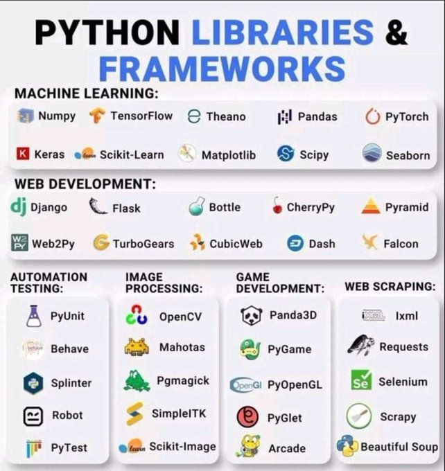
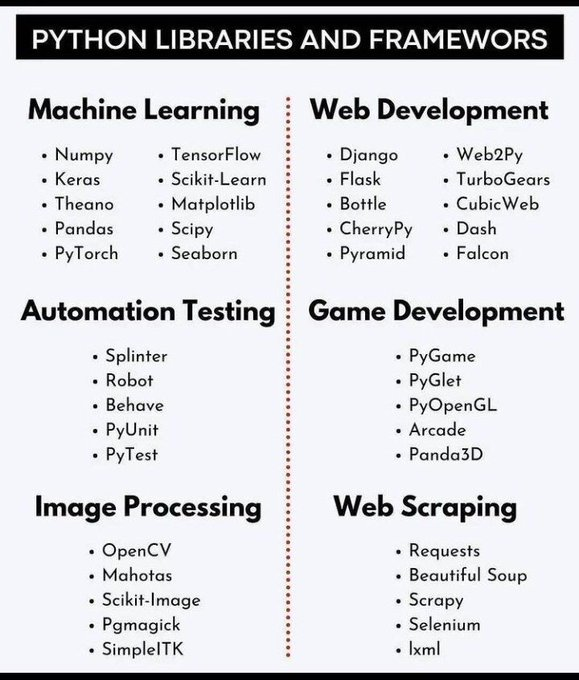

# Python

## Python Libraries & Frameworks (1)

## Python Libraries & Frameworks (2)

## Download do Python 3.8.0 
* https://www.python.org/downloads/

## Python Brazil (Grupo de Usuários) 
* Python.org.br https://python.org.br/
* Fórum Python Brasil Google Groups https://groups.google.com/forum/#!forum/python-brasil
* Eventos Python Brasil = https://python.org.br/eventos/

## IDEs Python para Download 
* Relação de IDEs Python = https://wiki.python.org.br/IdesPython
* Komodo IDE = https://www.activestate.com/products/komodo-ide/
* Apache NetBeans = https://netbeans.apache.org/features/python/index.html
* Ninja IDE = https://ninja-ide.org/
* Spyder Lib = https://code.google.com/archive/p/spyderlib/
* Eclipse IDE Download = https://www.eclipse.org/downloads/
* PyDev Development = http://pydev.sourceforge.net/index.html
* Anaconda Download = https://www.anaconda.com/
* KDevelop across-platform IDE = https://www.kdevelop.org/
* PyPE (Python Programmers Editor) = https://sourceforge.net/projects/pype/
* Wyng Python IDE Download = http://www.wingware.com/
* JetBrains PyCharm Python IDE = IDE https://www.jetbrains.com/pycharm/
* Iron Python IDE Download = https://ironpython.net/

## Python para quem está começando 
* Introdução ao Python = https://python.org.br/introducao/
* Aprenda a programar Python = https://wiki.python.org.br/AprendaProgramar
* Python para Web = https://wiki.python.org.br/PythonParaWeb
* Aprendendo computação com Python = https://aprendendo-computacao-com-python.readthedocs.io/en/latest/index.html
* Tutorial Python = https://wiki.python.org.br/Tutorial_Python
* Introdução ao Python (Microsoft Learning) = https://docs.microsoft.com/en-us/learn/modules/intro-to-python/
* Introdução ao Python (Microsoft Channel 9 - Videos) = https://channel9.msdn.com/Series/Intro-to-Python-Development
* Guia completo de Python (DevMedia) = https://www.devmedia.com.br/guia/python/37024
* Curso de Python (Youtube) = https://www.youtube.com/watch?v=S9uPNppGsGo
* Python Tutorial = http://www.analyticsvidhya.com/blog/2016/01/python-tutorial-list-comprehension-examples/?utm_content=buffer3143f&utm_medium=social&utm_source=linkedin.com&utm_campaign=buffer  
* Introdução ao Python = https://panda.ime.usp.br/cc110/static/cc110/index.html
* Python Data Science & Machine Learning = https://chrisalbon.com/
* Python Folha de Consulta = https://www.ime.usp.br/~vwsetzer/python-opers-funcoes.html

## Python Livros PDF
* Python Para Desenvolvedores (2a. edição) = https://ark4n.files.wordpress.com/2010/01/python_para_desenvolvedores_2ed.pdf
* Learn Python = http://do1.dr-chuck.com/pythonlearn/PT_br/pythonlearn.pdf 
* Python Orientação a Objetos = https://www.caelum.com.br/apostila/apostila-python-orientacao-a-objetos.pdf
* Introdução a Programação com Python = http://antigo.scl.ifsp.edu.br/portal/arquivos/2016.05.04_Apostila_Python_-_PET_ADS_S%C3%A3o_Carlos.pdf
* Apostila de Python = https://www.ufsm.br/laboratorios/lumac/wp-content/uploads/sites/679/2019/08/Apostila_Python_v_1.pdf
* Curso Introdutório de Python = https://buildmedia.readthedocs.org/media/pdf/curso-python/latest/curso-python.pdf
* Aprendendo Python = http://www.facom.ufu.br/~william/Disciplinas%202019-1/BIOTCH-GBT017-IntoducaoInformatica/285173966-aprendendo-python-pdf.pdf
* Pense em Python = https://penseallen.github.io/PensePython2e/

